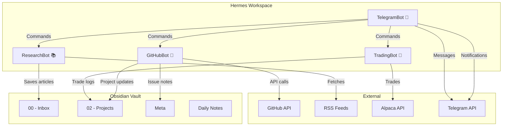

# 🤖 Hermes Bots Dashboard

> **Real-time overview of all Hermes bots in your second brain.**

## Bot Status Overview

```dataview
TABLE
  Bot,
  Type,
  Purpose,
  Status
FROM #bots
WHERE contains(file.outlinks, [[hermes-workspace/README]])
SORT file.name
```

## Active Bots

```dataview
LIST
FROM #bots AND -"hermes-workspace/README"
WHERE contains(file.outlinks, [[hermes-workspace/README]])
```

## Bot Details

```dataview
TABLE WITHOUT ID
  file.link AS "Bot",
  regexreplace(file.name, "^.", "") AS "Type",
  rows[file.name] AS "Files"
FROM "hermes-workspace"
WHERE file.mtime >= date(today) - dur(1 day)
GROUP BY file.folder
SORT file.folder
```

## Recent Bot Activity

```dataview
LIST
FROM "hermes-workspace/logs"
SORT file.mtime DESC
LIMIT 10
```

## Bot Connections

The following diagram shows how bots interact within your Obsidian vault:

### Data Flow

1. **[[ResearchBot]]** → monitors RSS feeds → saves articles to `[[00 - Inbox]]`
2. **[[GitHubBot]]** → monitors GitHub → creates notes in `[[Meta]]` and `[[02 - Projects]]`
3. **[[TradingBot]]** → monitors markets → logs trades to `[[02 - Projects]]`
4. **[[TelegramBot]]** → bridges all bots → sends notifications via Telegram

### Bot Relationships



## Quick Actions

- [[hermes-workspace/README|Workspace Overview]]
- [[TradingBot|TradingBot Details]]
- [[TelegramBot|TelegramBot Details]]
- [[GitHubBot|GitHubBot Details]]
- [[ResearchBot|ResearchBot Details]]
- [[hermes-workspace/config/README|Configuration]]

tags: #bots #dashboard #hermes
