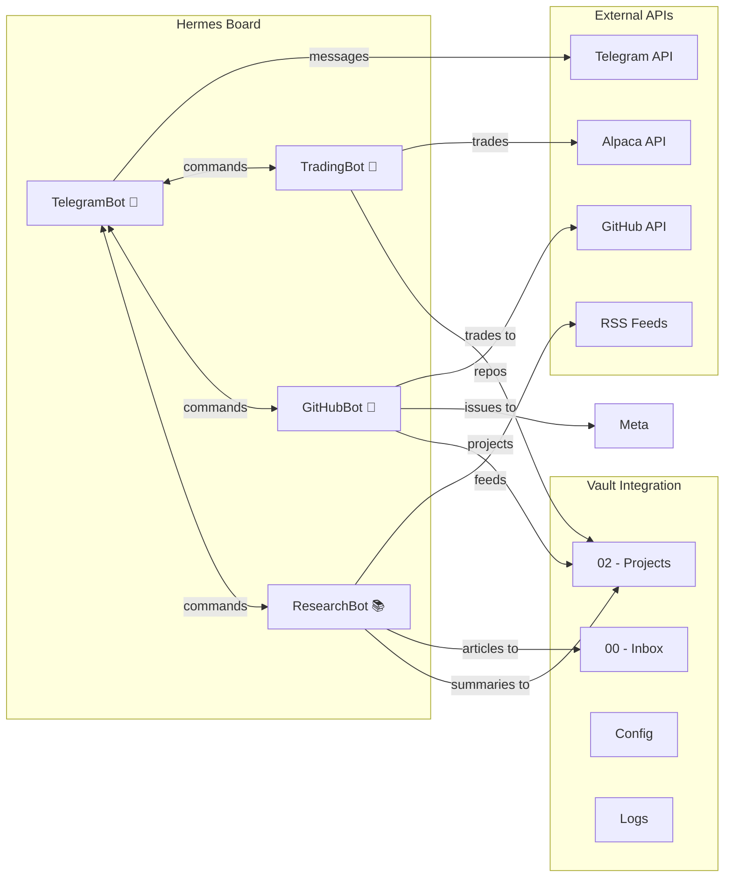

# Hermes Board — Bot Inventory

> **Central board listing all Hermes bots with status, links, and quick actions.**

## Board Overview

This is the **Hermes Board section** — your one-stop dashboard for all bots in your second brain.

## Active Bots

### 1. TradingBot 🤖
| Field | Value |
|-------|-------|
| **Status** | ✅ Running (Paper Trading) |
| **Language** | Python |
| **Note** | [[TradingBot]] |
| **Script** | `hermes-workspace/tradingbot/tradingbot.py` |
| **Config** | [[tradingbot/config.yaml]] |

### 2. TelegramBot 💬
| Field | Value |
|-------|-------|
| **Status** | ⚠️ Ready (needs Telegram token) |
| **Language** | Node.js |
| **Note** | [[TelegramBot]] |
| **Script** | `hermes-workspace/telegram-bot/telegram-bot.js` |
| **Config** | [[telegram-bot/package.json]] |

### 3. GitHubBot 🔧
| Field | Value |
|-------|-------|
| **Status** | ✅ Running (connected to `manikumarandugula77-coder/brain-`) |
| **Language** | Python |
| **Note** | [[GitHubBot]] |
| **Script** | `hermes-workspace/github-bot/github-bot.py` |
| **Config** | [[github-bot/config.yaml]] |

### 4. ResearchBot 📚
| Field | Value |
|-------|-------|
| **Status** | ✅ Running (5 RSS sources) |
| **Language** | Python |
| **Note** | [[ResearchBot]] |
| **Script** | `hermes-workspace/research-bot/research-bot.py` |
| **Config** | [[research-bot/config.yaml]] |

## Dataview: All Bots

```dataview
TABLE
  Bot,
  Type,
  Purpose,
  Status
FROM #bots
WHERE contains(file.outlinks, [[hermes-workspace/README]])
SORT file.name
```

## Dataview: Bot Files

```dataview
TABLE WITHOUT ID
  file.link AS "Note",
  file.folder AS "Location",
  file.size AS "Size (bytes)"
FROM "hermes-workspace"
WHERE file.extension = "py" OR file.extension = "js" OR file.extension = "yaml"
SORT file.size DESC
```

## Dataview: Recent Activity

```dataview
TABLE
  file.mtime AS "Last Modified"
FROM "hermes-workspace/logs"
SORT file.mtime DESC
LIMIT 10
```

## Mermaid: Board Overview



## Quick Links

- [[hermes-workspace/README|Hermes Workspace]]
- [[hermes-workspace/BOTS|Hermes Bots Dashboard]]
- [[hermes-workspace/config/README|Configuration Guide]]

tags: #heremes-board #bots #inventory #dashboard #hermes